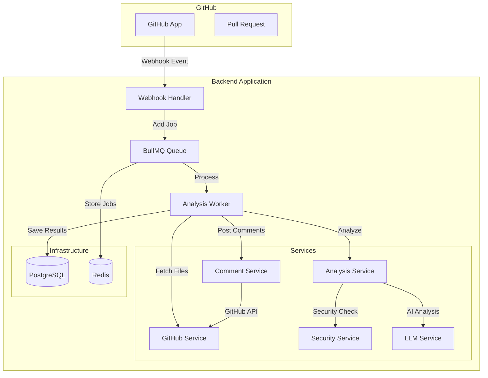
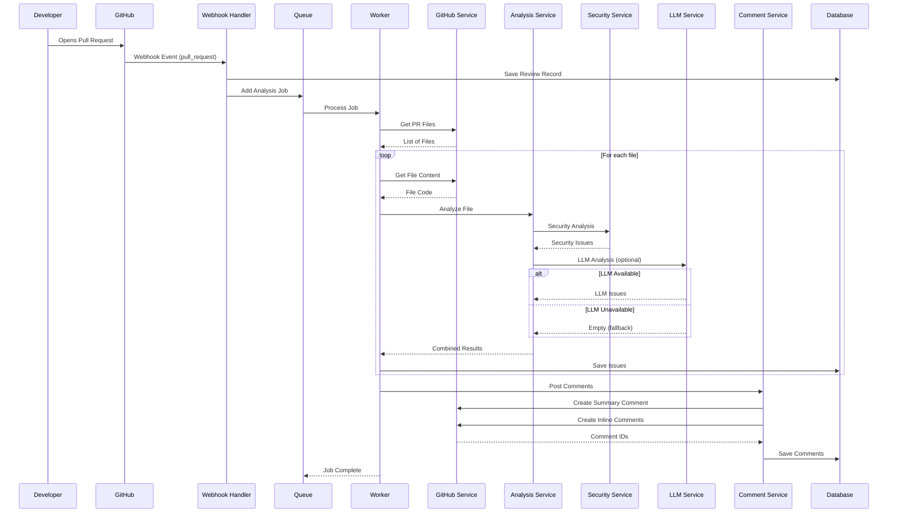
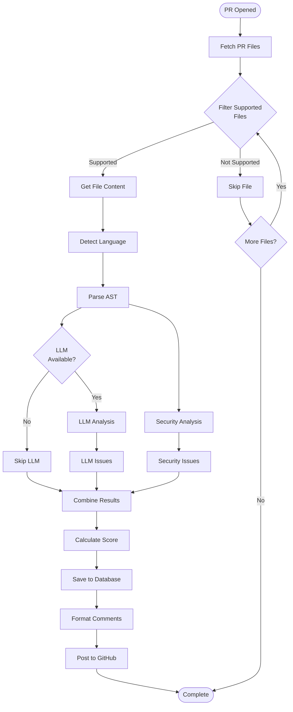
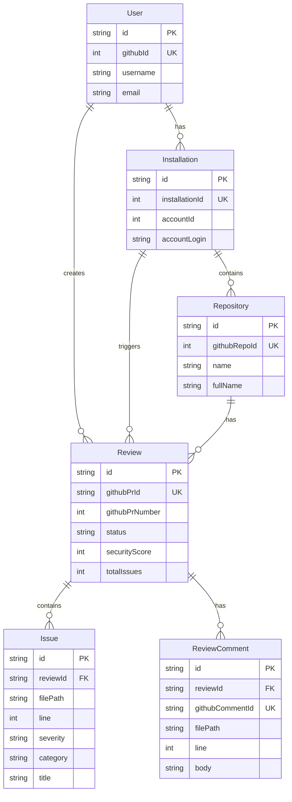
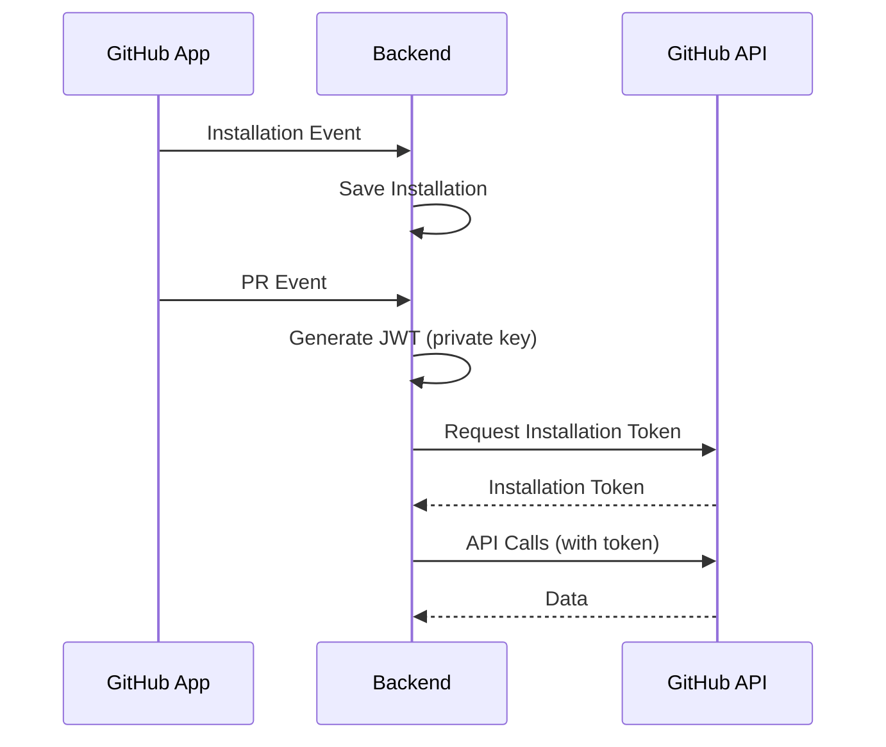

# 🏗️ Elementer Backend - Arhitektura i Dokumentacija

## 📋 Sadržaj

1. [Pregled Sistema](#pregled-sistema)
2. [Arhitektura](#arhitektura)
3. [Flow Dijagrami](#flow-dijagrami)
4. [Komponente](#komponente)
5. [Algoritam Analize](#algoritam-analize)
6. [Database Schema](#database-schema)
7. [API Endpoints](#api-endpoints)

---

## 🎯 Pregled Sistema

**Elementer** je AI-powered code review sistem koji automatski analizira Pull Request-ove na GitHub-u i postavlja detaljne komentare sa security, performance i best practice preporukama.

### Glavne Funkcionalnosti

1. **Automatska Analiza** - Analizira kod kada se otvori PR
2. **Multi-Layer Analiza** - Kombinuje Security Service i LLM analizu
3. **GitHub Integracija** - Postavlja komentare direktno na PR
4. **Asinhrono Procesiranje** - Koristi queue sistem za skalabilnost

---

## 🏛️ Arhitektura

### Visokonivo Arhitektura



### Komponente i Odgovornosti

| Komponenta | Odgovornost |
|------------|-------------|
| **Webhook Handler** | Prima GitHub webhook event-e, validira ih, dodaje job-ove u queue |
| **Queue (BullMQ)** | Upravlja asinhronim job-ovima, retry logika, rate limiting |
| **Analysis Worker** | Procesira analizu PR-a: dohvata fajlove, analizira, postavlja komentare |
| **GitHub Service** | Komunikacija sa GitHub API-jem (dohvatanje fajlova, postavljanje komentara) |
| **Security Service** | Statička analiza koda za security probleme (pattern matching) |
| **LLM Service** | AI analiza koda koristeći OpenAI GPT-4 |
| **Analysis Service** | Orchestrator koji kombinuje Security i LLM rezultate |
| **Comment Service** | Formatira i postavlja komentare na GitHub PR |

---

## 🔄 Flow Dijagrami

### 1. Pull Request Analiza Flow



### 2. Analiza Algoritam Flow



---

## 🧩 Komponente

### 1. Webhook Handler (`src/api/routes/webhooks.ts`)

**Odgovornost:** Prima i procesira GitHub webhook event-e.

**Event-i koje obrađuje:**
- `pull_request` - Kada se otvori ili ažurira PR
- `installation` - Kada se App instalira ili deinstalira

**Algoritam:**

```typescript
1. Primaj webhook event
2. Verifikuj signature (production)
3. Odmah odgovori GitHub-u (202 Accepted)
4. Procesiraj event asinhrono:
   - pull_request:
     a. Proveri da li je action = 'opened' ili 'synchronize'
     b. Kreiraj/update Review u bazi
     c. Dodaj Analysis Job u queue
   - installation:
     a. Sačuvaj Installation u bazi
     b. Sačuvaj Repository-e u bazi
```

**Ključne Funkcije:**
- `handleWebhookEvent()` - Router za različite event tipove
- `handlePullRequestEvent()` - Obrađuje PR event-e
- `handleInstallationEvent()` - Obrađuje installation event-e

---

### 2. Analysis Worker (`src/workers/analysis.worker.ts`)

**Odgovornost:** Procesira analizu PR-a asinhrono.

**Algoritam:**

```typescript
1. Dohvati PR fajlove (GitHub Service)
2. Za svaki fajl:
   a. Filtriraj podržane fajlove (JS/TS)
   b. Dohvati sadržaj fajla
   c. Analiziraj fajl (Analysis Service)
3. Agregiraj rezultate
4. Sačuvaj u bazu:
   - Update Review status
   - Kreiraj Issue zapise
5. Postavi komentare na GitHub:
   - Summary komentar
   - Inline komentari za kritične issue-e
```

**Konfiguracija:**
- `concurrency: 5` - Procesira 5 PR-ova simultano
- `limiter: 10 jobs/min` - Rate limiting
- `attempts: 3` - Retry failed jobs 3 puta

---

### 3. GitHub Service (`src/services/github.service.ts`)

**Odgovornost:** Komunikacija sa GitHub API-jem.

**Metode:**

| Metoda | Opis |
|--------|------|
| `getPullRequest()` | Dohvata PR informacije |
| `getPullRequestFiles()` | Dohvata listu fajlova u PR-u |
| `getFileContent()` | Dohvata sadržaj fajla |
| `createPRComment()` | Postavlja summary komentar |
| `createReviewComment()` | Postavlja inline komentar na liniju |

**Autentifikacija:**
- Koristi GitHub App installation token
- Automatski se obnavlja kada istekne

---

### 4. Security Service (`src/services/security.service.ts`)

**Odgovornost:** Statička analiza koda za security probleme.

**Algoritam:**

```typescript
1. Parse kod u AST strukturu
2. Za svaki security pattern:
   a. Proveri kod za pattern match
   b. Ako nađeš match:
      - Kreiraj SecurityIssue
      - Dodeli severity (CRITICAL/HIGH/MEDIUM/LOW)
      - Dodeli CWE/OWASP kategoriju
3. Vrati listu security issues
```

**Pattern-i koje detektuje:**

| Pattern | Severity | CWE |
|---------|----------|-----|
| Hardcoded passwords | CRITICAL | CWE-798 |
| SQL injection | CRITICAL | CWE-89 |
| XSS vulnerabilities | HIGH | CWE-79 |
| Insecure random | MEDIUM | CWE-330 |
| Console.log in production | LOW | - |

**Primer:**

```typescript
// Input
const code = "const password = 'secret123';"

// Output
[
  {
    severity: 'CRITICAL',
    category: 'SECURITY',
    title: 'Hardcoded Password Detected',
    description: 'Password is hardcoded in source code',
    line: 1,
    cweId: 'CWE-798',
    suggestedFix: 'Use environment variables or secure vault'
  }
]
```

---

### 5. LLM Service (`src/services/llm.service.ts`)

**Odgovornost:** AI analiza koda koristeći OpenAI GPT-4.

**Algoritam:**

```typescript
1. Konstruiši prompt sa:
   - Source code
   - Security issues (iz Security Service)
   - Kontekst (filename, language)
2. Pozovi OpenAI API (GPT-4)
3. Parse JSON response
4. Validiraj i normalizuj rezultate
5. Vrati LLM issues
```

**Prompt Struktura:**

```
You are an expert code reviewer. Analyze this code:

File: {filename}
Language: {language}

Code:
{code}

Known Security Issues:
{security_issues}

Provide:
1. Additional security issues
2. Performance improvements
3. Best practice recommendations
4. Code quality issues

Format: JSON with issues array
```

**Fallback:**
- Ako LLM nije dostupan (quota exceeded, error), vraća prazan rezultat
- Sistem nastavlja sa Security Service analizom

---

### 6. Analysis Service (`src/services/analysis.service.ts`)

**Odgovornost:** Orchestrator koji kombinuje Security i LLM rezultate.

**Algoritam:**

```typescript
1. Detektuj jezik (Language Detector)
2. Parse AST (AST Parser)
3. Security analiza (Security Service)
4. LLM analiza (LLM Service) - opciono
5. Kombinuj rezultate:
   a. Merguj Security i LLM issues
   b. Ukloni duplikate
   c. Sortiraj po severity
6. Izračunaj security score:
   score = 100 - (critical * 20 + high * 10 + medium * 5 + low * 1)
7. Generiši summary
8. Vrati AnalysisResult
```

**Score Kalkulacija:**

```typescript
function calculateScore(issues: Issue[]): number {
  const weights = {
    CRITICAL: 20,
    HIGH: 10,
    MEDIUM: 5,
    LOW: 1
  };
  
  let penalty = 0;
  for (const issue of issues) {
    penalty += weights[issue.severity] || 0;
  }
  
  return Math.max(0, Math.min(100, 100 - penalty));
}
```

**Primer Rezultata:**

```typescript
{
  filename: 'auth.ts',
  language: 'typescript',
  isSupported: true,
  score: 75,
  summary: 'Found 6 issues: 2 critical, 1 high, 2 medium, 1 low',
  allIssues: [
    { severity: 'CRITICAL', title: 'Hardcoded password', ... },
    { severity: 'HIGH', title: 'Missing input validation', ... },
    // ...
  ]
}
```

---

### 7. Comment Service (`src/services/github-comment.service.ts`)

**Odgovornost:** Formatira i postavlja komentare na GitHub PR.

**Algoritam:**

```typescript
1. Generiši summary komentar:
   - Security score
   - Ukupan broj issues
   - Breakdown po severity
   - Top issues
2. Postavi summary komentar na PR
3. Za kritične issue-e (CRITICAL/HIGH):
   a. Generiši inline komentar
   b. Postavi na specifičnu liniju
   c. Ograniči na 20 komentara (GitHub limit)
4. Sačuvaj komentare u bazu
```

**Format Summary Komentara:**

```markdown
## 🔍 Code Analysis Results

**Security Score:** 75/100

### Issues Found: 6
- 🔴 **Critical:** 2
- 🟠 **High:** 1
- 🟡 **Medium:** 2
- 🟢 **Low:** 1

### Top Issues:
1. Hardcoded password detected (Line 3)
2. Missing input validation (Line 6)
...
```

**Format Inline Komentara:**

```markdown
⚠️ **CRITICAL: Hardcoded Password**

Password is hardcoded in source code. This is a security risk.

**Suggested Fix:**
```typescript
// Instead of:
const password = 'secret123';

// Use:
const password = process.env.PASSWORD;
```

**CWE:** CWE-798
```

---

## 🗄️ Database Schema

### Entity Relationship Diagram



### Tabele i Odnosi

| Tabela | Opis | Ključni Podaci |
|--------|------|----------------|
| **User** | GitHub korisnici | githubId, username |
| **Installation** | GitHub App instalacije | installationId, accountLogin |
| **Repository** | GitHub repozitorijumi | githubRepoId, fullName |
| **Review** | PR analize | githubPrId, securityScore, status |
| **Issue** | Nađeni problemi u kodu | severity, category, line |
| **ReviewComment** | Komentari postavljeni na PR | githubCommentId, filePath, line |

---

## 🔌 API Endpoints

### Webhook Endpoints

| Endpoint | Method | Opis |
|----------|--------|------|
| `/webhook/github` | POST | Prima GitHub webhook event-e |

### Development Endpoints

| Endpoint | Method | Opis |
|----------|--------|------|
| `/health` | GET | Health check |
| `/test/queue` | POST | Test queue sistema |
| `/test/webhook` | POST | Test webhook handler-a |
| `/test/analysis` | POST | Test analize direktno |
| `/api/reviews` | GET | Lista svih review-a |
| `/api/reviews/:id` | GET | Detalji review-a |
| `/api/issues` | GET | Lista svih issue-a |

---

## 🔐 Autentifikacija

### GitHub App Flow



**Token Lifecycle:**
1. GitHub App generiše JWT koristeći private key
2. JWT se koristi za dobijanje installation access token-a
3. Installation token se koristi za API pozive
4. Token se automatski obnavlja kada istekne

---

## 📊 Performance i Skalabilnost

### Queue Konfiguracija

- **Concurrency:** 5 simultanih job-ova
- **Rate Limiting:** 10 job-ova/minut
- **Retry:** 3 pokušaja sa exponential backoff
- **Job Retention:** 24h (completed), 7d (failed)

### Optimizacije

1. **Asinhrono Procesiranje** - Webhook odgovara odmah, analiza ide u pozadini
2. **Queue Sistem** - Skalabilno, može dodati više worker-a
3. **Caching** - Redis za queue, moguće dodati cache za GitHub API pozive
4. **Batch Processing** - Grupiše komentare pre postavljanja

---

## 🚀 Deployment

### Environment Variables

```bash
# Server
NODE_ENV=production
PORT=3000

# Database
DATABASE_URL=postgresql://...

# Redis
REDIS_HOST=localhost
REDIS_PORT=6379

# GitHub App
GITHUB_APP_ID=...
GITHUB_PRIVATE_KEY=...
GITHUB_CLIENT_ID=...
GITHUB_CLIENT_SECRET=...
GITHUB_WEBHOOK_SECRET=...

# OpenAI
OPENAI_API_KEY=...

# URLs
FRONTEND_URL=https://...
API_URL=https://...
```

### Docker Compose

```yaml
services:
  postgres:
    image: postgres:15
    environment:
      POSTGRES_DB: elementer
      POSTGRES_USER: postgres
      POSTGRES_PASSWORD: postgres
  
  redis:
    image: redis:7-alpine
    ports:
      - "6379:6379"
```

---

## 📝 Napomene

### Trenutna Ograničenja

1. **Podržani jezici:** Samo JavaScript/TypeScript
2. **LLM Dependency:** Opciono, sistem radi i bez njega
3. **Inline Comments:** Maksimum 20 komentara po PR-u
4. **File Size:** Nema eksplicitnog limita, ali veliki fajlovi mogu biti spori

### Buduća Poboljšanja

1. **Više jezika:** Python, Java, Go, itd.
2. **Custom Rules:** Korisnici mogu definisati svoje pattern-e
3. **CI/CD Integracija:** Automatski blokira PR-ove sa kritičnim issue-ima
4. **Dashboard:** Web UI za pregled analiza
5. **Notifications:** Email/Slack notifikacije

---

## 🔗 Povezani Dokumenti

- [DOCUMENTATION.md](./DOCUMENTATION.md) - Osnovna dokumentacija
- [CODE_ANALYSIS_EXPLAINED.md](./CODE_ANALYSIS_EXPLAINED.md) - Detaljno objašnjenje analize
- [WEBHOOK_SETUP.md](./WEBHOOK_SETUP.md) - Webhook setup instrukcije
- [TESTING.md](./TESTING.md) - Testiranje instrukcije

---

**Poslednje ažuriranje:** 2026-01-25
