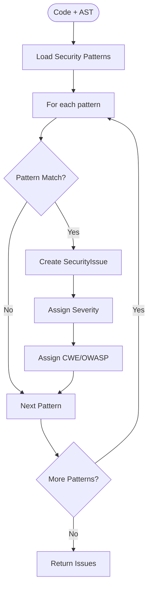
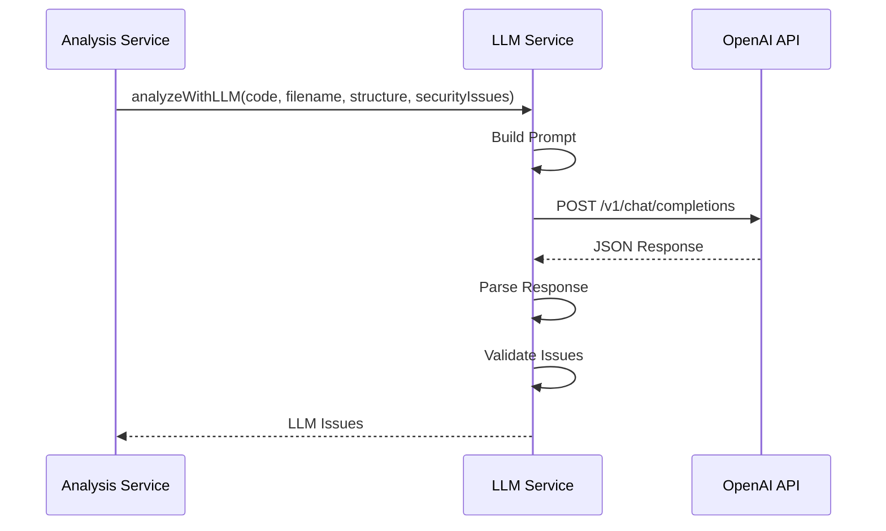
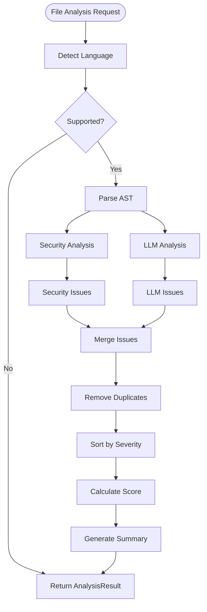
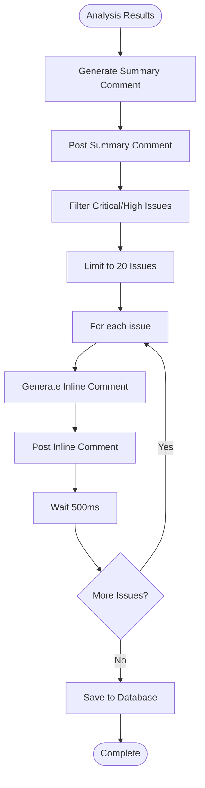
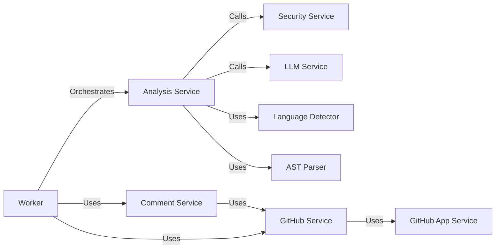

# 🔧 Services - Detaljno Objašnjenje

Ovaj dokument objašnjava svaki servis u backend aplikaciji detaljno, sa primerima i algoritmima.

---

## 📁 Struktura Servisa

```
src/services/
├── github-app.service.ts      # GitHub App autentifikacija
├── github.service.ts          # GitHub API komunikacija
├── github-comment.service.ts  # Formatiranje i postavljanje komentara
├── security.service.ts        # Security analiza (pattern matching)
├── llm.service.ts            # AI analiza (OpenAI GPT-4)
└── analysis.service.ts        # Orchestrator (kombinuje sve)
```

---

## 1. 🔐 GitHub App Service

**Fajl:** `src/services/github-app.service.ts`

### Šta Radi

Upravlja autentifikacijom sa GitHub App-om. Generiše JWT token-e i installation access token-e za pristup GitHub API-ju.

### Kako Funkcioniše

```typescript
1. Kreira GitHub App instancu sa:
   - App ID
   - Private Key (RSA)
   - Webhook Secret
   - OAuth Credentials

2. Kada treba pristup GitHub API-ju:
   a. Generiše JWT token (koristi private key)
   b. Koristi JWT da dobije installation access token
   c. Vraća Octokit instancu sa token-om
```

### Algoritam: Dobijanje Installation Token-a

```mermaid
flowchart TD
    START([Request Installation Token]) --> JWT[Generate JWT with Private Key]
    JWT --> REQUEST[POST /app/installations/{id}/access_tokens]
    REQUEST --> TOKEN[Receive Installation Token]
    TOKEN --> OCTOKIT[Create Octokit Instance]
    OCTOKIT --> RETURN[Return Authenticated Octokit]
```

### Ključne Funkcije

#### `getInstallationOctokit(installationId: number)`

**Input:**
```typescript
installationId: 105958386
```

**Output:**
```typescript
Octokit instance sa:
- rest.pulls.* (PR operacije)
- rest.repos.* (Repository operacije)
- rest.issues.* (Comment operacije)
```

**Algoritam:**
```typescript
1. Pokušaj da koristiš githubApp.getInstallationOctokit()
2. Proveri da li ima 'rest' property
3. Ako nema:
   a. Dobij installation token (createAppAuth)
   b. Kreiraj novi Octokit sa plugin-ima
   c. Vrati taj Octokit
4. Ako ima, vrati direktno
```

### Primer Korišćenja

```typescript
const octokit = await getInstallationOctokit(105958386);
const { data: pr } = await octokit.rest.pulls.get({
  owner: 'zirafica98',
  repo: 'ips-front',
  pull_number: 5
});
```

---

## 2. 📡 GitHub Service

**Fajl:** `src/services/github.service.ts`

### Šta Radi

Abstrakcija za GitHub API pozive. Omogućava dohvatanje PR informacija, fajlova, i postavljanje komentara.

### Metode

#### `getPullRequestFiles()`

**Šta radi:** Dohvata listu fajlova u PR-u sa diff informacijama.

**Input:**
```typescript
{
  owner: 'zirafica98',
  repo: 'ips-front',
  pullNumber: 5
}
```

**Output:**
```typescript
[
  {
    filename: 'src/auth.ts',
    additions: 15,
    deletions: 3,
    changes: 18,
    status: 'modified',
    patch: '@@ -1,3 +1,15 ...'
  }
]
```

**Algoritam:**
```typescript
1. Pozovi GitHub API: GET /repos/{owner}/{repo}/pulls/{number}/files
2. Mapiraj response u PRDiff format
3. Vrati listu fajlova
```

#### `getFileContent()`

**Šta radi:** Dohvata sadržaj fajla sa određenog commit-a.

**Input:**
```typescript
{
  owner: 'zirafica98',
  repo: 'ips-front',
  path: 'src/auth.ts',
  ref: '7414885fef623494375639561ed6f4ffea853f17'
}
```

**Output:**
```typescript
"export function authenticate() {\n  const password = 'secret';\n  ..."
```

**Algoritam:**
```typescript
1. Pozovi GitHub API: GET /repos/{owner}/{repo}/contents/{path}?ref={ref}
2. Dekoduj base64 content
3. Vrati string
```

#### `createPRComment()`

**Šta radi:** Postavlja summary komentar na PR.

**Input:**
```typescript
{
  owner: 'zirafica98',
  repo: 'ips-front',
  pullNumber: 5,
  body: '## Code Analysis Results...'
}
```

**Output:**
```typescript
{
  id: 3796157742,
  body: '...',
  user: { ... },
  created_at: '2026-01-25T08:53:11Z'
}
```

#### `createReviewComment()`

**Šta radi:** Postavlja inline komentar na specifičnu liniju u fajlu.

**Input:**
```typescript
{
  owner: 'zirafica98',
  repo: 'ips-front',
  pullNumber: 5,
  commitId: '7414885fef623494375639561ed6f4ffea853f17',
  body: '⚠️ CRITICAL: Hardcoded password...',
  path: 'src/auth.ts',
  line: 3
}
```

**Output:**
```typescript
{
  id: 2725062733,
  path: 'src/auth.ts',
  line: 3,
  body: '...',
  ...
}
```

**Napomena:** Ako linija nije u diff-u, GitHub vraća 422 error. Ovo je normalno ponašanje.

---

## 3. 🔒 Security Service

**Fajl:** `src/services/security.service.ts`

### Šta Radi

Statička analiza koda za security probleme koristeći pattern matching na AST strukturi.

### Algoritam Analize



### Security Pattern-i

#### 1. Hardcoded Secrets

**Pattern:**
```typescript
/password\s*[:=]\s*['"](.+?)['"]/gi
/api[_-]?key\s*[:=]\s*['"](.+?)['"]/gi
/secret\s*[:=]\s*['"](.+?)['"]/gi
```

**Primer:**
```typescript
// Input
const password = 'secret123';
const api_key = "abc123";

// Detektovano
[
  {
    severity: 'CRITICAL',
    title: 'Hardcoded Password Detected',
    line: 1,
    cweId: 'CWE-798'
  },
  {
    severity: 'CRITICAL',
    title: 'Hardcoded API Key Detected',
    line: 2,
    cweId: 'CWE-798'
  }
]
```

#### 2. SQL Injection

**Pattern:**
```typescript
/query\s*[+=]\s*['"](.*\$\{.*\}.*)['"]/gi
/query\s*[+=]\s*['"](.*\+.*)['"]/gi
```

**Primer:**
```typescript
// Input
const query = `SELECT * FROM users WHERE id = ${userId}`;

// Detektovano
{
  severity: 'CRITICAL',
  title: 'Potential SQL Injection',
  line: 1,
  cweId: 'CWE-89',
  suggestedFix: 'Use parameterized queries'
}
```

#### 3. XSS Vulnerabilities

**Pattern:**
```typescript
/innerHTML\s*=\s*(?!['"])(.+)/gi
/document\.write\s*\(/gi
```

**Primer:**
```typescript
// Input
element.innerHTML = userInput;

// Detektovano
{
  severity: 'HIGH',
  title: 'XSS Vulnerability - innerHTML',
  line: 1,
  cweId: 'CWE-79',
  suggestedFix: 'Use textContent or sanitize input'
}
```

#### 4. Insecure Random

**Pattern:**
```typescript
/Math\.random\(\)/gi
```

**Primer:**
```typescript
// Input
const token = Math.random().toString(36);

// Detektovano
{
  severity: 'MEDIUM',
  title: 'Insecure Random Number Generation',
  line: 1,
  cweId: 'CWE-330',
  suggestedFix: 'Use crypto.randomBytes() or crypto.getRandomValues()'
}
```

### Severity Mapping

| Severity | Weight | Kada se koristi |
|----------|--------|-----------------|
| **CRITICAL** | 20 | Hardcoded secrets, SQL injection, RCE |
| **HIGH** | 10 | XSS, CSRF, insecure authentication |
| **MEDIUM** | 5 | Insecure random, missing validation |
| **LOW** | 1 | Console.log, deprecated functions |

---

## 4. 🤖 LLM Service

**Fajl:** `src/services/llm.service.ts`

### Šta Radi

AI analiza koda koristeći OpenAI GPT-4. Pruža kontekstualne insights koje statička analiza ne može da detektuje.

### Algoritam



### Prompt Struktura

```typescript
const prompt = `
You are an expert code reviewer specializing in security, performance, and best practices.

Analyze this TypeScript code:

File: ${filename}
Language: ${language}

Code:
\`\`\`typescript
${code}
\`\`\`

Known Security Issues (already detected):
${JSON.stringify(securityIssues, null, 2)}

Provide a comprehensive code review focusing on:
1. Additional security vulnerabilities not caught by static analysis
2. Performance optimizations
3. Code quality improvements
4. Best practice recommendations
5. Potential bugs

For each issue, provide:
- severity: CRITICAL | HIGH | MEDIUM | LOW
- category: SECURITY | PERFORMANCE | QUALITY | BEST_PRACTICE
- title: Short descriptive title
- description: Detailed explanation
- line: Line number
- suggestedFix: Code example showing the fix
- cweId: CWE identifier if applicable
- owaspCategory: OWASP category if applicable

Return ONLY valid JSON in this format:
{
  "score": 0-100,
  "summary": "Brief summary",
  "issues": [
    {
      "severity": "HIGH",
      "category": "SECURITY",
      "title": "...",
      "description": "...",
      "line": 5,
      "suggestedFix": "...",
      "cweId": "CWE-XXX",
      "owaspCategory": "A1"
    }
  ]
}
`;
```

### Primer Response-a

```json
{
  "score": 75,
  "summary": "Found 4 issues: 1 high security, 2 performance, 1 best practice",
  "issues": [
    {
      "severity": "HIGH",
      "category": "SECURITY",
      "title": "Missing Input Validation",
      "description": "The authenticate function does not validate user input before processing",
      "line": 3,
      "suggestedFix": "Add input validation:\nif (!username || !password) {\n  throw new Error('Invalid input');\n}",
      "cweId": "CWE-20",
      "owaspCategory": "A03"
    },
    {
      "severity": "MEDIUM",
      "category": "PERFORMANCE",
      "title": "Inefficient String Concatenation",
      "description": "Using + operator in loop causes multiple string allocations",
      "line": 10,
      "suggestedFix": "Use array.join() or template literals"
    }
  ]
}
```

### Error Handling

```typescript
try {
  // OpenAI API call
} catch (error) {
  if (error.status === 429) {
    // Quota exceeded - fallback to Security Service only
    logger.warn('LLM quota exceeded, using Security Service only');
    return emptyResult;
  }
  throw error;
}
```

---

## 5. 🎯 Analysis Service

**Fajl:** `src/services/analysis.service.ts`

### Šta Radi

Orchestrator koji koordinira celu analizu: detektuje jezik, parsira AST, poziva Security i LLM servise, kombinuje rezultate.

### Algoritam



### Funkcija: `analyzeFile()`

**Input:**
```typescript
{
  code: "export function auth() { const p = 'secret'; }",
  filename: "auth.ts"
}
```

**Output:**
```typescript
{
  filename: "auth.ts",
  language: "typescript",
  isSupported: true,
  score: 80,
  summary: "Found 2 issues: 1 critical, 1 medium",
  allIssues: [
    {
      severity: "CRITICAL",
      category: "SECURITY",
      title: "Hardcoded Password",
      line: 1,
      ...
    },
    {
      severity: "MEDIUM",
      category: "PERFORMANCE",
      title: "Inefficient Loop",
      line: 5,
      ...
    }
  ]
}
```

### Score Kalkulacija

```typescript
function calculateScore(issues: Issue[]): number {
  const weights = {
    CRITICAL: 20,
    HIGH: 10,
    MEDIUM: 5,
    LOW: 1
  };
  
  let penalty = 0;
  for (const issue of issues) {
    penalty += weights[issue.severity] || 0;
  }
  
  // Score = 100 - penalty, clamped to 0-100
  return Math.max(0, Math.min(100, 100 - penalty));
}
```

**Primer:**
```typescript
Issues: [
  { severity: 'CRITICAL' },  // -20
  { severity: 'HIGH' },       // -10
  { severity: 'MEDIUM' }      // -5
]

Penalty: 20 + 10 + 5 = 35
Score: 100 - 35 = 65
```

### Deduplikacija

```typescript
function deduplicateIssues(securityIssues: Issue[], llmIssues: Issue[]): Issue[] {
  const seen = new Set<string>();
  const merged: Issue[] = [];
  
  for (const issue of [...securityIssues, ...llmIssues]) {
    // Create unique key: file:line:title
    const key = `${issue.filePath}:${issue.line}:${issue.title}`;
    
    if (!seen.has(key)) {
      seen.add(key);
      merged.push(issue);
    }
  }
  
  return merged;
}
```

---

## 6. 💬 Comment Service

**Fajl:** `src/services/github-comment.service.ts`

### Šta Radi

Formatira analizu rezultate u Markdown komentare i postavlja ih na GitHub PR.

### Algoritam



### Format Summary Komentara

```markdown
## 🔍 Code Analysis Results

**Security Score:** 75/100 ⭐⭐⭐

### 📊 Summary
- **Total Issues:** 6
- **Files Analyzed:** 1
- **Analysis Time:** 2.3s

### 🎯 Issues Breakdown
- 🔴 **Critical:** 2
- 🟠 **High:** 1
- 🟡 **Medium:** 2
- 🟢 **Low:** 1

### 🔥 Top Issues

1. **Hardcoded Password Detected** (Line 3)
   - **Severity:** CRITICAL
   - **Category:** SECURITY
   - **CWE:** CWE-798
   - Password is hardcoded in source code

2. **Missing Input Validation** (Line 6)
   - **Severity:** HIGH
   - **Category:** SECURITY
   - **CWE:** CWE-20
   - User input is not validated before processing

---

*This analysis was performed by Elementer AI Code Review*
```

### Format Inline Komentara

```markdown
⚠️ **CRITICAL: Hardcoded Password Detected**

Password is hardcoded in source code. This is a critical security vulnerability.

**Suggested Fix:**
\`\`\`typescript
// Instead of:
const password = 'secret123';

// Use:
const password = process.env.PASSWORD || '';
if (!password) {
  throw new Error('PASSWORD environment variable is required');
}
\`\`\`

**CWE:** CWE-798  
**OWASP:** A07:2021 – Identification and Authentication Failures
```

### Rate Limiting

```typescript
// Delay između komentara da ne preopteretimo GitHub API
for (const issue of issues) {
  await postComment(issue);
  await new Promise(resolve => setTimeout(resolve, 500)); // 500ms delay
}
```

---

## 🔄 Interakcija Između Servisa



---

## 📝 Best Practices

### 1. Error Handling

Svi servisi imaju try-catch blokove i loguju greške:

```typescript
try {
  // Service logic
} catch (error) {
  logger.error('Service failed:', error);
  throw error; // Re-throw za worker da može da retry-uje
}
```

### 2. Type Safety

Svi servisi koriste TypeScript tipove:

```typescript
interface AnalysisResult {
  filename: string;
  language: string;
  isSupported: boolean;
  score: number;
  allIssues: Issue[];
}
```

### 3. Logging

Svi servisi loguju svoje akcije:

```typescript
logger.info('Starting analysis', { filename });
logger.debug('Security issues found', { count: issues.length });
logger.warn('LLM unavailable, using Security Service only');
```

---

**Poslednje ažuriranje:** 2026-01-25
